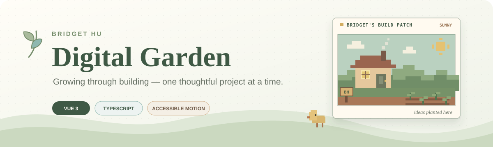

<p align="center">
  
</p>

<p align="center">
  <strong>A warm, evolving portfolio for projects, learning, and the quieter things beyond code.</strong>
</p>

<p align="center">
  
  
  
  
  
</p>

<p align="center">
  <a href="#about-this-garden">Overview</a> ·
  <a href="#experience-the-garden">Experience</a> ·
  <a href="#project-map">Project map</a> ·
  <a href="#local-development">Development</a> ·
  <a href="#content-guide">Content guide</a>
</p>

---

## About this garden

Bridget Hu's Digital Garden is a responsive personal portfolio built around one idea:
**growing through building**. It brings selected software projects, a learning journey,
current interests, and personal notes into a bright editorial experience that feels more
like a tended corner of the web than a conventional developer template.

The visual system combines warm paper surfaces, sage green, lake blue, clay accents,
botanical line art, and original generic pixel-farm details. Every illustration is built
inside the repository; the website does not depend on remote images, external font
services, a backend, a database, or API keys.

> Thoughtful software can still feel human, calm, and full of character.

## Experience the garden

| Area | What it adds |
| --- | --- |
| **Living hero** | An animated plant grows from an open notebook, with Build, Learn, and Explore leaves. |
| **Original farm patch** | Hills, crops, a turning windmill, growing plant, and clickable geometric chick add a personal farm-game reference without borrowed assets. |
| **Project greenhouse** | Four original farm metaphors visualize diagnosis, dialogue, structured records, and modeling without changing project data. |
| **Growth path** | Seed, sprout, and leaf stages communicate Bridget's build–collaborate–reflect approach. |
| **Seasonal journey** | A four-stage vine draws through Starting, Building, Learning, and Still Growing while preserving real years and events. |
| **Day / Evening** | A stored, accessible theme switch moves between bright paper tones and a gray-blue farm evening with warm window light. |
| **Pixel keepsakes** | Five original Beyond Code objects — wooden sign, chick, plant, piano, and seed bag — add quiet visual interactions without sound. |
| **Garden interaction layer** | A bounded Canvas trail draws soft gold stars, seeds, leaves, and a tiny pixel-flower bloom on click. |

### Design principles

1. **Natural, not nostalgic by imitation** — pixel elements are original and use a generic
   farm-game vocabulary rather than borrowed characters, maps, icons, fonts, or UI.
2. **Warm, not visually flat** — depth, light, parallax, staggered reveals, and tactile hover
   feedback add polish without introducing neon or cyberpunk motifs.
3. **Expressive, not distracting** — motion stays small, short, and secondary to the content.
4. **Accessible by default** — keyboard focus, semantic markup, responsive layouts, and
   reduced-motion behavior are treated as core features.

## Technology

| Layer | Tools |
| --- | --- |
| Interface | Vue 3, TypeScript |
| Build system | Vite 7 |
| Styling | Tailwind CSS 4, handcrafted CSS |
| Motion | GSAP, Intersection Observer, Canvas 2D |
| Icons | lucide-vue-next |
| Package manager | pnpm 10 |
| Deployment | GitHub Actions, GitHub Pages workflow |

## Project map

```text
bridget-hu.github.io/
├─ .github/workflows/deploy.yml     # GitHub Pages build and deployment
├─ public/
│  ├─ favicon.svg
│  └─ readme-banner.svg             # Original repository banner
├─ src/
│  ├─ components/
│  │  ├─ CursorTrail.vue            # Bounded Canvas particle system
│  │  ├─ PixelFarmScene.vue         # Original pixel farm vignette
│  │  ├─ PixelFarmDecor.vue         # Five pixel keepsakes, including the wooden sign
│  │  ├─ ThemeToggle.vue            # Stored Day / Evening control
│  │  ├─ PlantHeroVisual.vue        # Animated botanical hero
│  │  ├─ ProjectCard.vue            # Pointer-aware project presentation
│  │  └─ ...                        # About, journey, growth, contact, and more
│  ├─ composables/
│  │  └─ useGardenReveal.ts         # Motion-aware viewport reveals
│  ├─ data/                         # Projects, journey, current focus, contact
│  ├─ styles/
│  │  ├─ main.css                   # Core design system and responsive layout
│  │  ├─ interactions.css           # Progressive interaction layer
│  │  └─ theme.css                  # Day / Evening palette and transitions
│  ├─ App.vue
│  └─ main.ts
├─ package.json
└─ vite.config.ts
```

## Local development

### Requirements

- Node.js 22 or later
- pnpm 10

### Start the development server

```bash
pnpm install
pnpm dev
```

Vite will print the local address, normally `http://localhost:5173`.

### Validate a production build

```bash
pnpm typecheck
pnpm build
```

Preview the generated `dist` directory:

```bash
pnpm preview
```

## Interaction and accessibility

The interaction layer is progressive and intentionally conservative:

- the cursor Canvas only starts on devices that support both `hover` and a `fine` pointer;
- touch and coarse-pointer devices do not initialize the trail;
- `prefers-reduced-motion: reduce` disables the Canvas and decorative animations;
- the animation loop stops when no particles remain and pauses while the page is hidden;
- particle count and device pixel ratio are capped to keep rendering work bounded;
- the Canvas uses `pointer-events: none`, so links, buttons, selection, and scrolling remain
  unaffected;
- project depth effects are limited to fine-pointer devices and reset on pointer exit or
  keyboard blur;
- Day / Evening choice is stored locally, requires no theme library, and keeps static
  deployment behavior unchanged;
- mobile layouts disable cursor and Hero pointer parallax while simplifying decorative
  pixel motion.

## Content guide

The portfolio content is deliberately separated from most presentation code.

| Content | File |
| --- | --- |
| Projects and illustration variants | `src/data/projects.ts` |
| Journey entries | `src/data/journey.ts` |
| Currently Growing items | `src/data/current.ts` |
| Email, GitHub, and resume settings | `src/data/contact.ts` |
| About copy and interest tags | `src/components/AboutSection.vue` |
| Beyond Code interests | `src/components/BeyondCodeSection.vue` |
| Global palette and responsive rules | `src/styles/main.css` |
| Motion and pixel-farm polish | `src/styles/interactions.css` |
| Day / Evening theme palette | `src/styles/theme.css` |

### Email and resume placeholders

Replace `REPLACE_WITH_YOUR_EMAIL` in `src/data/contact.ts` when a public contact address is
ready.

To add a resume:

1. add the real file to `public`, for example `public/resume.pdf`;
2. set `RESUME_URL` in `src/data/contact.ts` to `'/resume.pdf'`.

Until those values are provided, the website displays **Email coming soon** and
**Resume coming soon** instead of creating invalid links.

## Deployment

The repository includes `.github/workflows/deploy.yml`. A push to `main` installs locked
dependencies, builds the site, uploads `dist`, and deploys it through GitHub Pages.

For this user-site repository, Vite uses the root base path `/`. In GitHub, set
**Settings → Pages → Build and deployment → Source** to **GitHub Actions**. GitHub Pages
availability for a private repository depends on the account plan; a public repository can
use the standard Pages workflow.

---

<p align="center">
  <em>Designed as a digital garden: useful today, still growing tomorrow.</em>
</p>
